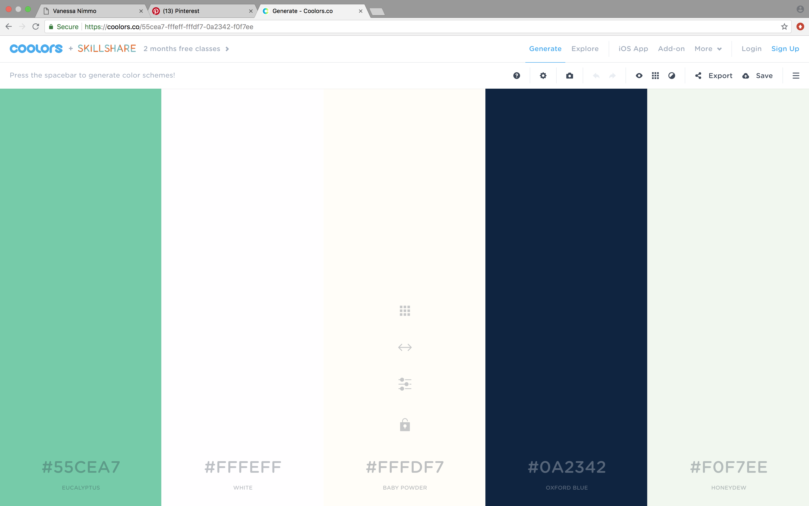
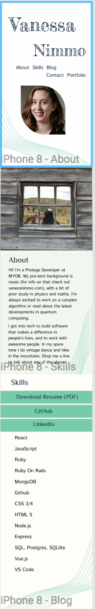
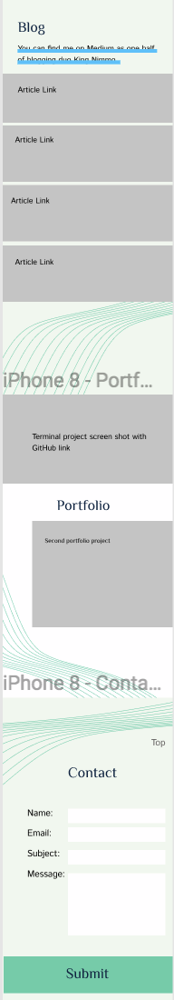
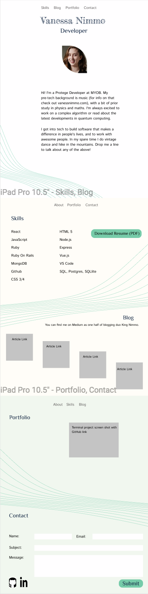
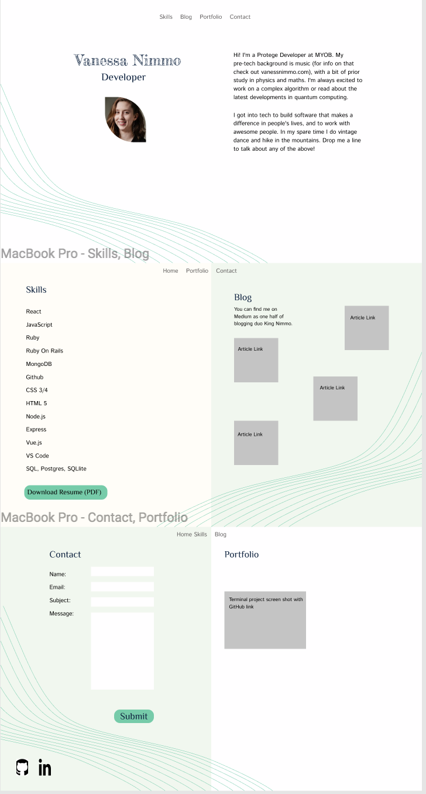
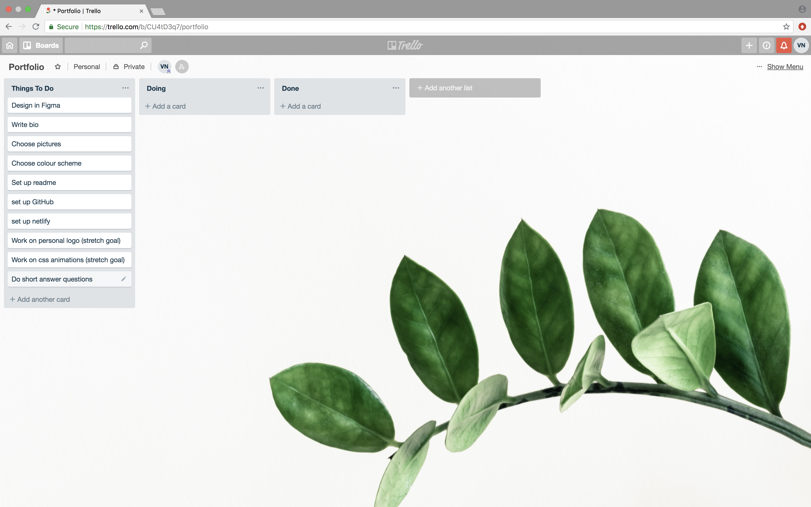
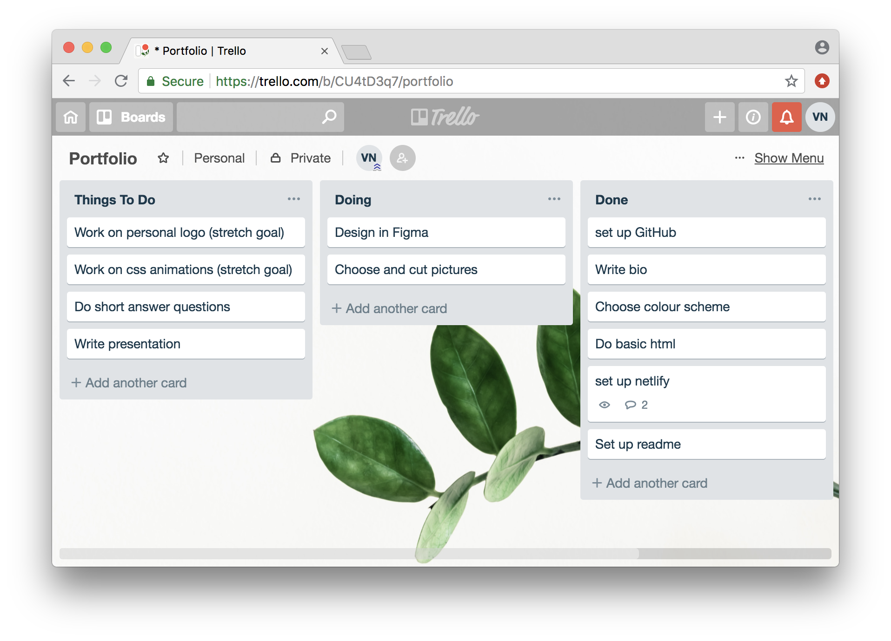
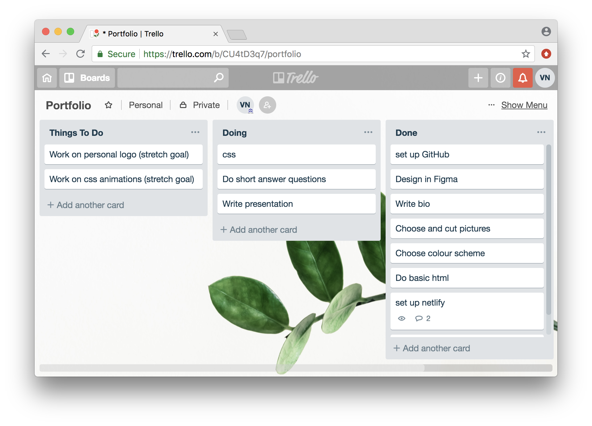

# Portfolio - Vanessa Nimmo

[Live website](https://vanessanimmo.github.io/)

[GitHub Repository](https://github.com/VanessaNimmo/portfolio)

## Purpose

This website is intended to represent me and develop my reputation in the tech industry in the long term.

## Functionality / features

My portfolio website is a one-page scrolling website with the following features:

- Pictures of me looking friendly
- Short bio which introduces my interests, both professional and personal, and invites people to get in touch
- Skills list, including all the technologies covered by the end of the CA course
- Portfolio with links to projects completed during the course
- Blog page with a link to the tech-related blog I run with co-author King, as well as links to several articles on the blog written solely by me
- Contact form through which people can reach me, which emails their information to me

## Sitemap

As a one-page site, a sitemap is not necessarily.

## Screenshots

## Target Audience

The usual audience for a professional profile is employers and recruiters. Knowing that I have a job at MYOB directly after the CA course impacted my design decisions and encouraged me to think longer-term. I've considered the target audience for this website to be my existing employer (for understanding what internal roles I might suit) and also MeetUp and Conference organisers, who are often other developers.

## Tech stack (e.g. html, css, deployment platform, etc)

The site is built using html and css. It is hosted on Github Pages, which desploys continuosly from the GitHup Repository, with each push triggering a build.

# Design Process
## Inspiration

Begun by gathering together images I liked on Pinterest. I'm into maths and nature, so focussed on these areas looking for common themes.

[Pinterest Board](https://pin.it/o2zl7vze7ca2xa)

Also spent time looking at websites with 'design eyes' on. What did I like about the websites I use every day? How were they fit for purpose? How were they not? And what have other developers used for their portfolios?

Chose a colour palette with the help of coolors.co: [Colour Palette](https://coolors.co/55cea7-fffeff-fffdf7-0a2342-f0f7ee)

## Wireframes

All wireframes for the project can be found in [this Figma file](https://www.figma.com/file/ND9mk1S2PJvtuXOZ18vqxJja/portfolio?node-id=0%3A1). Here are some screenshots of the relevant final designs.

Mobile

Tablet

Laptop

## Usability considerations

HTML Markup: aimed to choose the most appropriate tags for each element to aid screen readers in navigating the site.

Colours: used to colours to ensure high contrast ratios for all text.

Font choices: as well as using clean sans serif fonts to aid in readability, I set font size using points in the body, and then using ems for the rest of the site. This means that even on screens with high pixel density the font won't get too small. Font is also smaller for mobile devices, as they are generally held closer to the user.

# Planning Process
## Project plan & timeline

**Pre-work**

Before receiving the assignment information on Canvas, we knew we were creating a personal portfolio website. Knowing that I'm fairly confident with code but far less confident with design, I spent my time on populating a Pinterest board with images that I felt connected to and investigating what other developers had done for their websites. There are also awards for well-designed websites, so I looked at websites that had recently won in order to see what was possible.

**Monday**

Worked on content - biography, skills, portfolio, blog and pictures.

**Tuesday**

Finalise design and colour choices and finish wireframing in Figma. Set up project resources (e.g. GitHub, Trello, README, file system as described in Canvas).

**Wednesday**

Get final approval for website design. Begin coding with plain HTML, focussing on using appropriate tags for content to make the site accessible to screen readers. Set up Netlify deployment.

NB: Netlify deployment didn't work, and discovered github.io, so went with that as it was very doable in a short amount of time.

**Thursday**

Finish coding the static webpage.

**Friday**

Write presentation. Play with CSS animation.

**Monday**

Presentation

## Screenshots of Trello board(s)

Trello board at setup:

Trello board Wednesday afternoon: 

Trello board Friday afternoon:

## Short Answer Q&A 

Describe key events in the development of the internet from the 1980s to today (max. 150 words)

Define and describes the relationship between fundamental aspects of the internet such as: domains, web servers, DNS, and web browsers (max. 150 words)

The location of files or resources on the internet is addressed using the Domain Name System (DNS). Rather than requiring humans to remember the IP addresses used by routers, the DNS uses text-based addressing, which is converted as it moves down the layers of the computer system and into the internet. When you put a website into the address bar, the browser sends an HTTP request to the relevant web server (found using the DNS), which sends back the requested website for the browser to display on your screen. 

Reflect on one aspect of the development of internet technologies and how it has contributed to the world today (max. 150 words)

Wifi